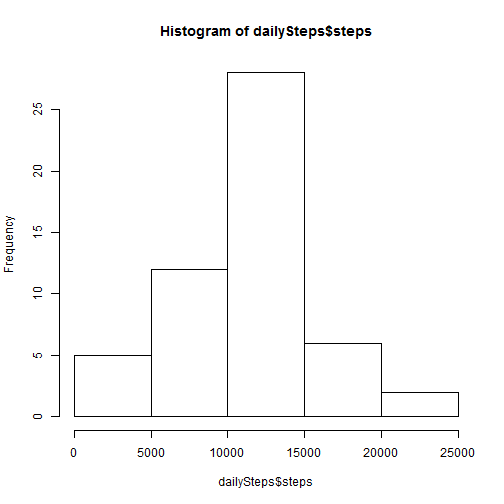
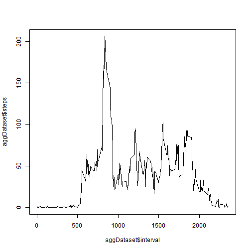
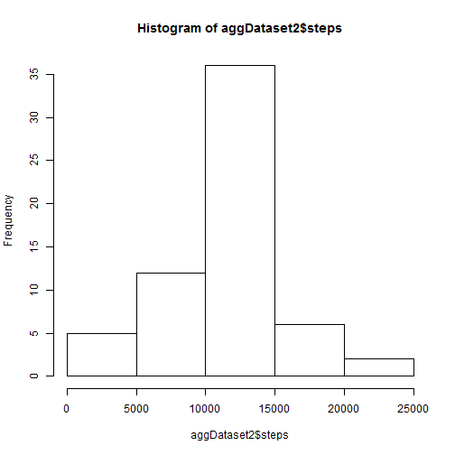

## Loading and preprocessing the data

1. Load the data (i.e. read.csv())

```r
## numbers >= 10^5 will be denoted in scientific notation,
## and rounded to 2 digits
options(scipen = 2, digits = 2)

dataset <- read.csv("activity.csv", stringsAsFactors = FALSE)
```
2. Process/transform the data (if necessary) into a format suitable for your analysis

```r
dailySteps<-aggregate(steps~date,data=dataset,sum,na.rm=TRUE)
```

## What is mean total number of steps taken per day?
1. Make a histogram of the total number of steps taken each day

```r
hist(dailySteps$steps)
```

 
2. Calculate and report the mean and median total number of steps taken per day

```r
mean_raw <- mean(dailySteps$steps, na.rm = TRUE)
median_raw <- median(dailySteps$steps, na.rm=TRUE)
```
Mean total number of steps per day: 10766.19

Median total number of steps per day: 10765

## What is the average daily activity pattern?

1. Make a time series plot (i.e. type = "l") of the 5-minute interval (x-axis) and the average number of steps taken, averaged across all days (y-axis)

```r
aggDataset<-aggregate(steps~interval,data=dataset,mean,na.rm=TRUE)
plot(aggDataset$steps~aggDataset$interval, type="l")
```

 
2. Which 5-minute interval, on average across all the days in the dataset, contains the maximum number of steps?

```r
aggDataset[which.max(aggDataset$steps), ]$interval
```

```
## [1] 835
```


## Imputing missing values

There are 2304 missing values.

To fix this, I've replaced all missing values with the average for the interval:


```r
interval_to_steps<-function(interval){
    aggDataset[aggDataset$interval==interval,]$steps
}
fixedNAs = dataset
count = 0
for(i in 1:nrow(fixedNAs)){
    if(is.na(fixedNAs[i,]$steps)){
        fixedNAs[i,]$steps<-interval_to_steps(fixedNAs[i,]$interval)
        count=count+1
    }
}
```


```r
aggDataset2 <- aggregate(steps ~ date, data = fixedNAs, sum)
```

Make a histogram of the total number of steps taken each day and Calculate and report the mean and median total number of steps taken per day. Do these values differ from the estimates from the first part of the assignment? What is the impact of imputing missing data on the estimates of the total daily number of steps?

```r
hist(aggDataset2$steps)
```

 

Now that we have a clean dataset, let's compute some new clean averages:

```r
mean_clean <- mean(aggDataset2$steps)
median_clean <- median(aggDataset2$steps)
```

These new clean mean is 10766.19 steps per day.

And the clean median is 10766.19 steps per day.

While the median has stayed the same (which makes sense, since we removed the NA values in the first calculation), the median has slightly changed. This is based largely on where the NA values fell.


## Are there differences in activity patterns between weekdays and weekends?

First, let's use the weekdays function to determine what day of the week every measurement takes place in.

```r
fixedNAs$weekday <- weekdays(as.Date(as.character(fixedNAs$date)))
```

Then we'll label each day as a weekday or weekend, and turn this into a factor variable.


```r
fixedNAs$DayOrEnd <- ifelse(fixedNAs$weekday=="Saturday"|fixedNAs$weekday == "Sunday","weekend", "weekday")
fixedNAs$DayOrEnd=factor(fixedNAs$DayOrEnd,levels=c("weekday","weekend"))
```

And now we'll add the lattice package to create a nice little plot.


```r
library(lattice)
```

We can now aggregate our data, averaging the number of steps into each interval for both weekdays and weekends.


```r
finalDataset=aggregate(steps~interval+DayOrEnd,fixedNAs,mean)
```

And finally, let's construct the plot with lattice, making sure to set the aspect so we have a horizontal arrangement of our graphs.


```r
xyplot(steps~interval|factor(DayOrEnd),data=finalDataset,aspect=1/2,type="l")
```

 

As you can see, there is a slight difference between average number of steps taken on weekdays and weekends: on weekdays, there's usually a spike in the mid-morning, while on weekends, the number of steps more closely conforms to a bell curve.
